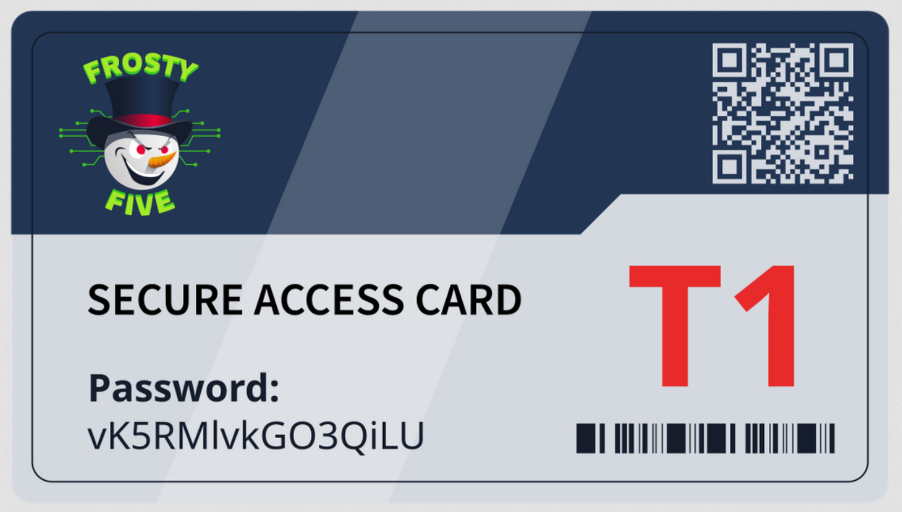

# Advent of Cyber 2024 and Side Quest Notes

## Day 1 - The Beginning

* After using a youtube link on the site, there is a download of a zip. After extracting the zip (I used 7z x \<file\>), the files can be examined with the `file` command. Using `exiftool` on them yields useful/interesting information.

* Following a github link in the data on the files, the powershell script is visible. Following all of the information gathered thus far- specifically a signature the author wrote into the script- the github account of the author as well as the author's collaborator/the original author can be found on GitHub.

* After browsing the GitHubs and all of the previously mentioned information, the flask C2 server can be accessed. The port and secret key are in the C2 source code. Using `flask-unsign`, a session cookie can be forged. I found this from `hacktricks` using Google.

* The session key ended up being: session | eyJsb2dnZWRfaW4iOnRydWV9.Z01Oww.zdmlo7hl2Wv8XD4b04Oy-6tAjhE

* Navigating to the /dashboard API endpoint of the C2 server with this cookie allows access to the C2 dashboard.

* This can be found there along with a lot of other information:

---